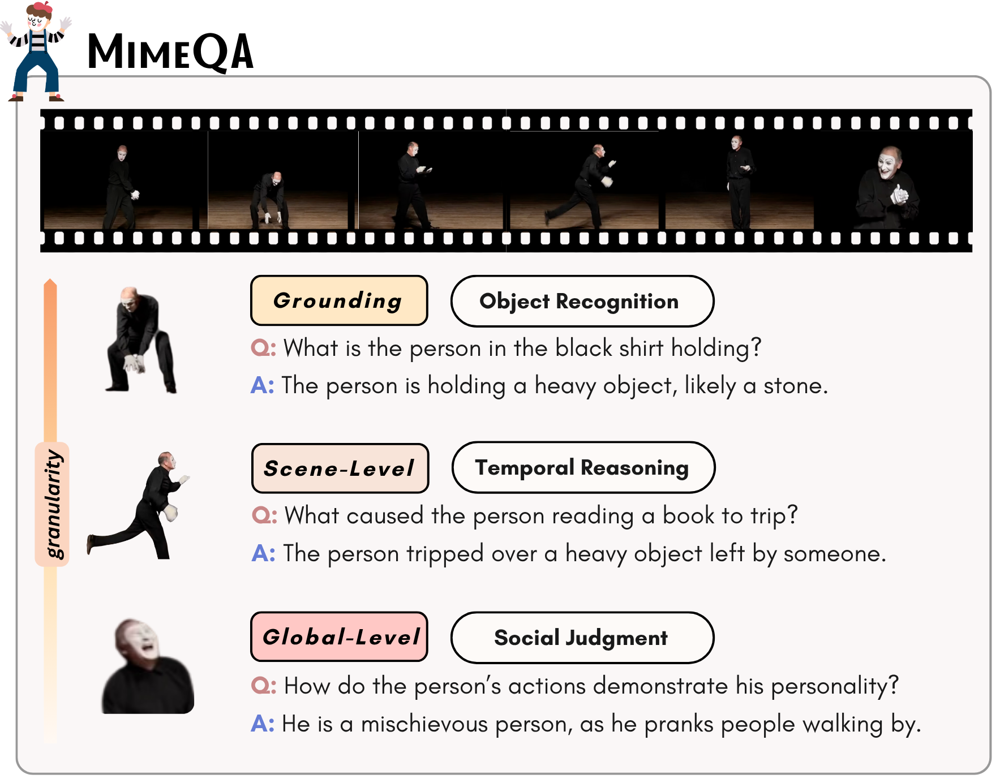

# MimeQA: Towards Socially-Intelligent Nonverbal Foundation Models
[](https://huggingface.co/datasets/hzli1202/MimeQA)
[](https://arxiv.org/abs/2502.16671)

MimeQA is a video question-answering benchmark designed to evaluate nonverbal social reasoning capabilities of AI models. Sourced from ~8 hours of mime performances on YouTube, it comprises 101 videos and 806 open-ended QA pairs that span fine-grained perceptual grounding to high-level social cognition. Unlike existing social video benchmarks that involves human dialogues, MimeQA challenges models to interpret nonverbal, embodied gestures in the absence of speech, props, or narration.



## 📂 Dataset Access

The full dataset is hosted on Hugging Face:
👉 [MimeQA on Hugging Face](https://huggingface.co/datasets/hzli1202/MimeQA)

MimeQA evaluates the capacity of AI systems to understand nonverbal communication and social interactions through mime videos. The dataset consists of short video segments (1–10 minutes) paired with open-ended questions and a single-sentence answer. Questions span a three-tier hierarchy:

- **Grounding the Imagined**: recognizing pretend objects or activities through gestures.
- **Scene-Level**: reasoning over local events, affect, and intentions.
- **Global-Level**: evaluating working memory, social judgment, and theory of mind across entire videos.
  
The dataset is densely annotated, with ~8 QA pairs per video, and includes optional timestamps for localized segments. MIMEQA is particularly challenging for current video-language models: while humans score ~86%, top models only perform between 20–30% accuracy.

## 🔗 Resources
- [Paper](https://arxiv.org/abs/2502.16671)
- [Data](https://huggingface.co/datasets/hzli1202/MimeQA)

## 📑 Citation
If you use MimeQA in your research, please cite our paper ❤️ 

```bibtex
@article{li2025mimeqa,
  title={MimeQA: Towards Socially-Intelligent Nonverbal Foundation Models},
  author={Li, Hengzhi and Tjandrasuwita, Megan and Fung, Yi R and Solar-Lezama, Armando and Liang, Paul Pu},
  journal={arXiv preprint arXiv:2502.16671},
  year={2025}
}
```
